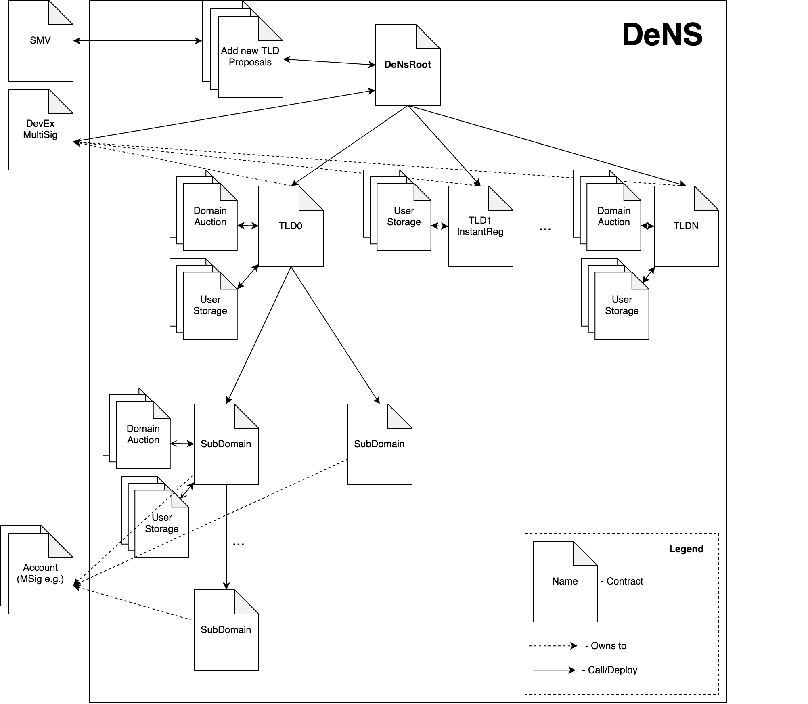
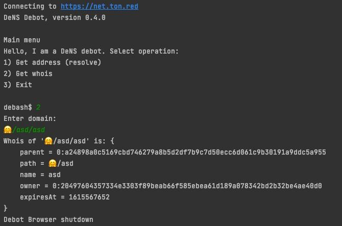

# TON Decentralized Name Service (DeNS)
### Key Features
* True TIP-2, infinity amount of subdomains and levels 
* Add new top level domains(root domains) with SMV interface
* Buy domains at Auction 
* Instant buy Domain Name for short period with fixed price
* Reselling subdomains of your domain 
* Gas managing, no need to replenish certificates
* Build and tests with Github Actions(broken with last update(0.38), will be fixed)
## Domain and subdomain registration options
Each Name certificate has own type of registration child domains. Registration type and other parameters can be changed by an owner of certificate.

Child certificates can be issued no longer than the expiration period of the parent certificate. 

```solidity
enum RegistrationTypes { OwnerOnly, Auction, Instant }
function setRegistrationType(RegistrationTypes newRegistrationType) external;
```
### Auction
One Auction contract will be deployed one per domain for a buy. All bids are made blindly by sending hash of (bid + salt). Then, during the confirmation phase, participant need to send the entire bet and salt.

The highest bid wins, but participant need to pay for the domain according to the size of the second bid. 

Anyone can create Auction for child domain by sending specific request to NIC if domain available or expiration < 28 Days.
```solidity
function registerNameByAuction(string domainName, uint8 durationInYears, uint256 bidHash) external;
function setAuctionDeposit(uint32 auctionDeposit) external;
```
To prevent bet spam, it is possible to set the size of the blind bet.

### Instant Buy
Option to buy domain right now for short period of time avoiding the auction. Max duration and price installed by owner.
```solidity
function registerInstantName(string domainName, uint32 durationInSec) external;
function setInstantBuyPrice(uint128 instantBuyPrice) external;
function setInstantBuyMaxSecDuration(uint32 instantBuyMaxSecDuration) external;
```
### Create by Owner
New certificates can be issued by an owner.
```solidity
function registerNameByOwner(string domainName, uint32 expiresAt) external;
```


## Build and run
### Requirements:
* ton-solidity `0.37.0`
* tvm-linker
* nodejs

### Setup environment
Copy `.env.dist` to `.env` and change variables up to you
* `SOLC_BIN` - path to solc binary file
* `TVM_LINKER_BIN` - path to tvm-linker binary file
* `STDLIB_PATH` - path to `stdlib_sol.tvm` lib 
* `NETWORK` - DApp server address or Node SE 

Install node js dependencies
```shell
npm install
```

For view all make instructions

```shell
make help
```

Compile, deploy and test all contracts

```shell
make build
make deploy
make tests
```
### System diagram 

### Example of "get Whois info" with debot 

